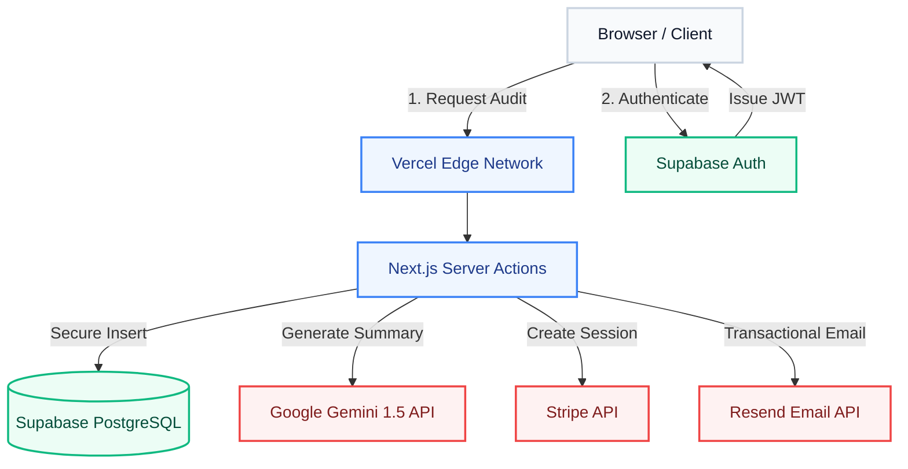
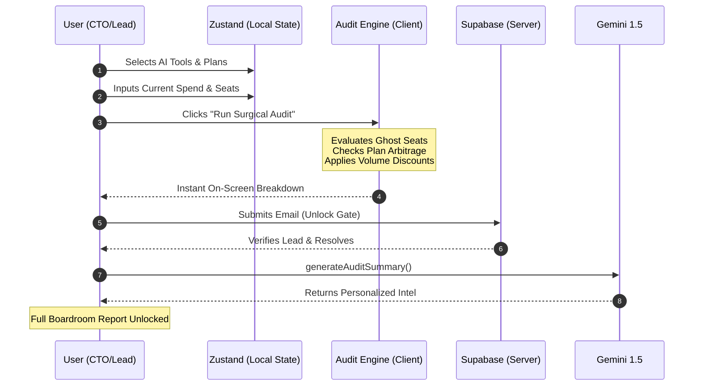

# 🏗️ System Architecture & Engineering Strategy

  
  
  

---

## 1. Executive Overview

DexAudit is engineered as a **Stateless, High-Velocity SaaS application**. The primary architectural directive is to minimize latency during the audit generation phase while ensuring strict data privacy. By leveraging edge computing and serverless infrastructure, the platform scales elastically from zero to thousands of concurrent audit generations without infrastructure bottlenecks.

---

## 2. High-Level System Architecture

The following topological structure outlines the DexAudit platform's current production state.

---

## 3. Data Flow: From Input to Audit Result

The core value proposition of DexAudit is its mathematical arbitrage engine. To maximize perceived performance and privacy, this process executes entirely on the client side, only touching the server during the final lead capture phase.

---

## 4. Technology Stack & Strategic Justification

We avoided complex monoliths in favor of a lean, highly modular serverless stack.

| Layer | Technology | Engineering Rationale |
| :--- | :--- | :--- |
| **Framework** | **Next.js 15 (App Router)** | React Server Components (RSC) drastically reduce client-side JS payloads. Server Actions eliminate the need for an external, vulnerable API layer. |
| **Database & Auth** | **Supabase** | Chosen over Firebase/MongoDB for robust Row Level Security (RLS) and seamless SSR integration. PostgreSQL provides the relational integrity required for future enterprise billing features. |
| **Styling** | **Tailwind CSS + shadcn/ui** | "Zero-runtime" styling ensures maximum Lighthouse performance (Crucial for SEO). shadcn/ui provides unstyled, accessible primitives customized for our B2B aesthetic. |
| **Intelligence** | **Google Gemini 1.5 Flash** | Selected for its sub-second latency. Sub-second response times are critical for maintaining the "instant audit" illusion during the lead capture phase. |
| **Payments** | **Stripe Checkout** | Industry standard. We utilize server-side dynamic price generation to prevent client-side price tampering. |

---

## 5. Scaling to 10,000 Audits / Day

While the current architecture handles moderate loads efficiently, a sustained throughput of 10k audits/day (approx. 7 audits/minute, with heavy concurrent spikes) would require the following architectural shifts:

### A. Database Bottleneck Mitigation
Currently, every lead submission triggers a direct PostgreSQL `INSERT`. At 10k/day, connection pooling limits could be breached during traffic spikes (e.g., a viral HackerNews launch).
- **The Fix:** Implement an asynchronous queuing mechanism. Lead data would be pushed to a fast cache (like **Upstash Redis**) or a queue (like **AWS SQS** / **Inngest**). A background worker would then batch-insert records into Supabase, protecting the database from concurrent connection exhaustion.

### B. AI Rate Limiting & Cost Control
10,000 daily calls to the Gemini API would rapidly hit rate limits and drive up operational costs.
- **The Fix:** Implement **Semantic Caching**. If two companies with identical team sizes and tool stacks request an audit, the system should return a cached LLM response instead of querying the API again. Furthermore, a fallback queue would ensure that if the API rate-limits us, the user still receives the hardcoded mathematical audit immediately, while the AI summary is emailed later.

### C. Edge Caching for Pricing Data
Currently, pricing benchmarks are hardcoded into standard constants (`lib/tools.ts`). While fast, updating them requires a code deployment.
- **The Fix:** Move pricing data to a CMS or Edge Config (e.g., Vercel Edge Config) so pricing can be updated dynamically by the finance team without a rebuild, while maintaining 0ms latency globally.