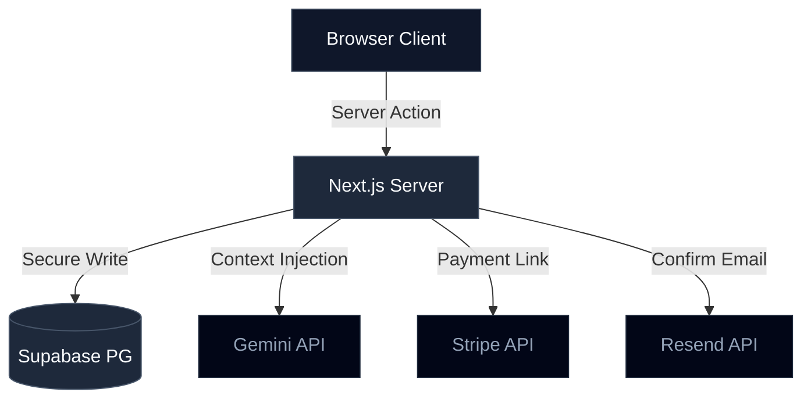
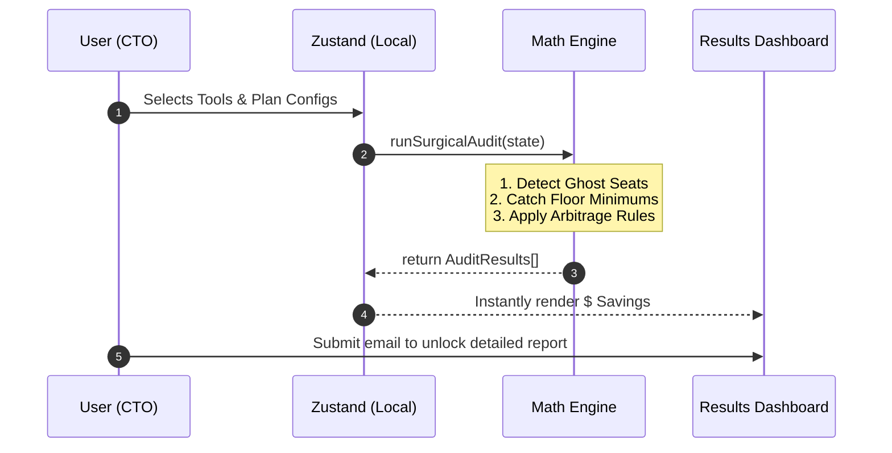

<div align="center">

# ⚡ DexAudit

**Industrial-Grade AI Spend Intelligence for Engineering Leaders**

*Last Production Deployment: May 26, 2026*

Detect ghost seats, arbitrage AI plans, and stop burning runway on unused subscriptions.

[](https://vercel.com/new)

[](https://dexaudit.vercel.app)
[](#-architecture--data-flow)
[](#-tech-stack)
[](#-ai-strategy)
[](#-developer-experience)

<br/>

<a href="https://dexaudit.vercel.app">
  
</a>

</div>

<br/>

## 📖 Table of Contents

- [The Mission](#-the-mission)
- [Core Features](#-core-features)
- [Tech Stack](#-tech-stack)
- [Architecture & Data Flow](#-architecture--data-flow)
- [Engineering Decisions](#-engineering-decisions)
- [Performance & Security](#-performance--security)
- [AI Strategy](#-ai-strategy)
- [Developer Experience](#-developer-experience)
- [Roadmap](#-roadmap)

---

## 🎯 The Mission

The modern engineering stack is fragmented. Startups routinely over-forecast AI needs—buying GitHub Copilot Enterprise, Claude Team, and Cursor Business—only to realize a fraction of their developers actually utilize the premium tiers.

There was no _“Mint for AI spend.”_ **DexAudit exists to fix this.** It provides deterministic, zero-latency financial arbitrage, instantly identifying ghost seats, plan minimum violations, and volume discount opportunities. We build for CTOs who value fiscal clarity as much as technical velocity.

---

## ✨ Core Features

| Feature                    | Description                                                                                        | Status  |
| :------------------------- | :------------------------------------------------------------------------------------------------- | :------ |
| **Surgical Arbitrage**     | Deterministic math engine to catch plan downgrades (e.g., Copilot Enterprise -> Business).         | ✅ Live |
| **Ghost Seat Detection**   | Cross-references actual headcount vs. purchased licenses to identify exact capital waste.          | ✅ Live |
| **Boardroom-Grade Export** | Client-side DOM-to-PDF compilation for beautiful, shareable C-suite reports.                       | ✅ Live |
| **Frictionless Funnel**    | Zero-login requirement to see baseline savings. High-intent email gate for the detailed breakdown. | ✅ Live |
| **AI Executive Summary**   | Google Gemini 1.5 Flash parses raw audit JSON to generate personalized consulting intelligence.    | ✅ Live |

---

## 🛠️ Tech Stack

Built for velocity, scale, and extreme type safety.

### 💻 Frontend & UI

| Tech                        | Role                                                                                     |
| :-------------------------- | :--------------------------------------------------------------------------------------- |
| **Next.js 15 (App Router)** | Core React framework utilizing React Server Components (RSC) for minimal client-side JS. |
| **Tailwind CSS v3**         | Utility-first styling with zero runtime overhead.                                        |
| **shadcn/ui & Radix**       | Headless accessible primitives for a minimal, "Pro" B2B aesthetic.                       |
| **Zustand**                 | Lightweight atomic state management for the multi-step audit workflow.                   |

### ⚙️ Backend & Infrastructure

| Tech                      | Role                                                                       |
| :------------------------ | :------------------------------------------------------------------------- |
| **Supabase (PostgreSQL)** | Persistent storage with Row Level Security (RLS) and integrated Auth APIs. |
| **Vercel**                | Global Edge deployment with sub-second Time-to-First-Byte (TTFB).          |
| **Stripe**                | Dynamic Checkout flows for "Pro Tier" audit upgrades.                      |
| **Resend**                | Transactional email delivery for audit confirmations.                      |

---

## 🏗️ Architecture & Data Flow

DexAudit utilizes a stateless serverless topology, ensuring the database is only touched during the final lead capture, keeping the core funnel operating at 0ms latency.

### High-Level System Architecture



### Audit Engine Data Flow



---

## 🧠 Engineering Decisions

We prioritize shipping reliable products over chasing hyped patterns.

<details>
<summary><b>1. Client-Side Math vs. Server-Side Processing</b></summary>
<br/>
<b>Decision:</b> Execute the core mathematical arbitrage engine entirely on the client side.<br/>
<b>Why:</b> Provides a zero-latency, "instant" feeling for the user, maximizing engagement before the email gate, while completely eliminating server costs for top-of-funnel traffic. The trade-off is exposing the calculation logic in the bundle, which is acceptable for an open utility tool.
</details>

<details>
<summary><b>2. Post-Value Email Gate vs. Upfront Signup</b></summary>
<br/>
<b>Decision:</b> Keep the core audit tool completely free and un-gated, asking for the email only <i>after</i> the total savings number is revealed.<br/>
<b>Why:</b> Dramatically reduces Top-of-Funnel friction. Users experience the "Sunk Cost Fallacy"—they've already done the work; they want to see the details. This yields higher intent leads for Credex.
</details>

<details>
<summary><b>3. Custom PDF Assembly vs. Native PDF Libraries</b></summary>
<br/>
<b>Decision:</b> Used a custom multi-stage `html2canvas` + `jsPDF` capture strategy.<br/>
<b>Why:</b> Allowed perfect recycling of existing Tailwind CSS designs (including complex SVG tool logos) for a premium, boardroom-ready look without having to rewrite the entire UI in primitive PDF components.
</details>

<details>
<summary><b>4. Supabase vs. Custom Postgres + Prisma</b></summary>
<br/>
<b>Decision:</b> Opted for Supabase via Next.js Server Actions.<br/>
<b>Why:</b> Setting up Prisma with a raw database for a simple `leads` table is overkill. Supabase provided instant RLS security and out-of-the-box Auth APIs, sacrificing deep schema control for extreme shipping velocity.
</details>

<details>
<summary><b>5. Gemini 1.5 Flash vs. GPT-4o</b></summary>
<br/>
<b>Decision:</b> Selected Gemini Flash for the personalized AI summary generation.<br/>
<b>Why:</b> The task requires parsing structured JSON into a 100-word paragraph. GPT-4o is too slow for real-time UI. Gemini Flash provides sub-second latency, which is crucial for maintaining the "instant" UX during the "Unlock Report" state.
</details>

---

## ⚡ Performance & Security

### Performance Metrics

- **Lighthouse Performance:** 90+ (Optimized via RSC & Tailwind)
- **Zero CLS:** Global Skeleton UI implemented across all dynamic routes.
- **Payload:** Minimal client-side hydration via Next.js 15.

### Security & Abuse Prevention

- **Honeypot Traps:** Invisible form fields to block automated bot submissions.
- **Rate Limiting:** 60-second IP/Email cooldown on lead capture endpoints.
- **Row Level Security (RLS):** Supabase DB strictly prevents anonymous read/write operations.

---

## 🚀 AI Strategy

We explicitly do **not** use AI for math. LLMs hallucinate numbers.
The financial calculations are 100% deterministic TypeScript logic based on verified vendor pricing.

AI (Gemini 1.5 Flash) is utilized strictly for **Qualitative Synthesis**—reading the JSON output of the math engine and generating a personalized, empathetic executive summary to build trust and bridge the gap between "Numbers" and "Actionable Strategy."

---

## 💻 Developer Experience

Clone, Install, and Audit in under 2 minutes.

### Prerequisites

- Node.js 20+
- Supabase Project (Postgres)
- Stripe API Keys
- Google Gemini API Key

### Quick Start

```bash
# 1. Clone the repository
git clone https://github.com/ROHITKUMAWAT001/Dexaudit.git
cd dexaudit

# 2. Install dependencies
npm install

# 3. Setup environment variables
cp .env.example .env.local
# Add your specific keys to .env.local

# 4. Run the Vitest suite (9 tests passing)
npm run test

# 5. Start development
npm run dev
```

---

## 🗺️ Roadmap

- [x] Initial UI and Landing Page
- [x] Deterministic Audit Engine implementation
- [x] Supabase Database & Auth integration
- [x] Stripe Checkout integration
- [x] Boardroom PDF Generation
- [x] Gemini AI Summary implementation
- [x] Vitest Automated Testing (9/9 passing)
- [ ] Vercel Analytics instrumentation
- [ ] OAuth integration for Ramp/Brex (Automated Spend Ingestion)

---

## 📄 License

This project is licensed under the MIT License - see the [LICENSE](LICENSE) file for details.

<br/>
<div align="center">
  <p>Built with ⚡ for the next generation of engineering founders.</p>
</div>
